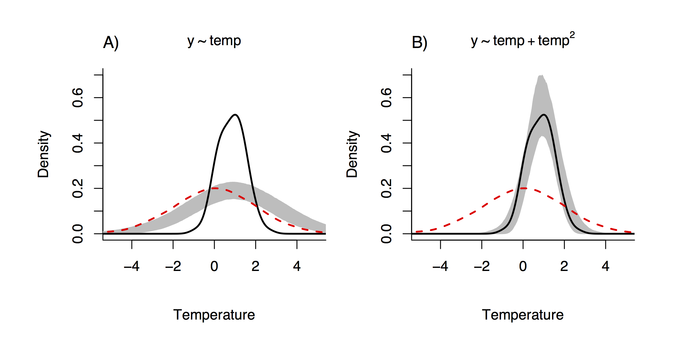

# uhcplots

**In Development** *These tools are being developed and have not yet been fully tested.*

Create Used-Habitat Calibration Plots as described in Fieberg et al. (In review for Ecography).

Programmer: John Fieberg | Secondary Programmer: Althea ArchMiller

Fieberg, Forester, Street, Johnson, ArchMiller, and Matthiopoulos. In Review. Used-habitat calibration plots: A new procedure for validating species distribution, resource selection, and step-selection models. Ecography.

## Used-Habitat Calibration plots (UHC plots)

Used-Habitat Calibration plots are a new method for model calibration that can be applied across a spectrum of species distribution models (SDMs) (Fieberg et al. In review for Ecography). To create a UHC plot, we first split our data into training and testing data sets. Then, we:

1. Summarize the distribution of the covariates at used points in the dataset
2. Fit a model to the training dataset and store coefficients and their variance/covariances
3. (a) Select a new vector of parameters from the joint parameter distribution from step [2]; (b) estimate the relative probability of selection for the test data; (c) select a random sample of test observations with probabilities from step [3b], and (d) summarize the distribution of the covariates associated with the points chosen in step [3c]. Repeat this some number M times.
4. Compare the observed distribution of covariate values at the presence points from step [1] with the predicted distribution of these characteristics from step [3] across M simulations. One option is to overlay the observed distribution on a 95% simulation envelope constructed using the M results from step [3d]. 

With UHC plots, we can validate models by comparing the distributions of observed and predicted values of the explanatory variables at the presence (or used) locations and compare them with the distributions of the absence (or background) locations. For instance, let's suppose that we have a species that is distributed on the landscape based on a quadratic relationship with temperature (x). The following figure demonstrates that when we fit a mis-specified model (i.e., linear temperature covariate only; left panel), our UHC simulation envelope (grey band) fails to contain the distribution of temperature at used/presence locations (solid black line). This indicates that the model is not well-calibrated. When we add the quadratic temperature term, the UHC simulation envelope contains the used location distribution (right panel), indicating a well-calibrated model. The data used in this example can be simulated with the `uhcdatasimulator` function. The distribution of available or background points is given in this plot as a red dashed line.

